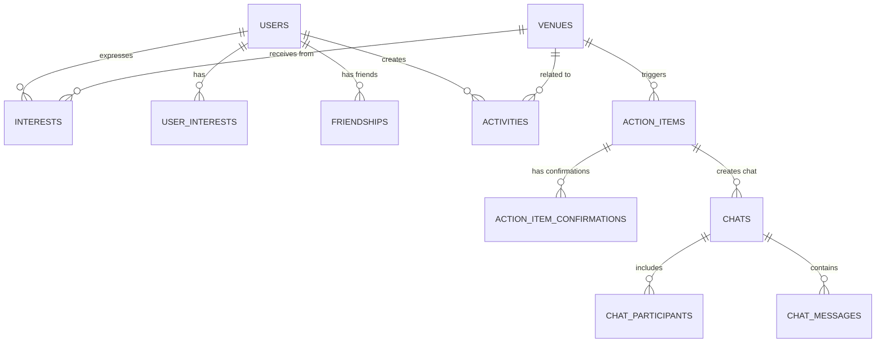

## Overview

The Luna backend uses **SQLite** with **SQLAlchemy 2.0 async ORM** for data persistence. The schema includes 11 tables managing users, venues, interests, friendships, and social features.

<Info>
All models use async SQLAlchemy with proper indexing for optimal query performance.
</Info>

## Entity Relationship Diagram



## Core Tables

### UserDB

Stores user profile information with geographic location.

```python models/db_models.py
class UserDB(Base):
    """User model for storing user profile information."""
    __tablename__ = "users"
    
    id = Column(String(100), primary_key=True)
    name = Column(String(255), nullable=False)
    avatar = Column(String(500), nullable=False)
    bio = Column(Text, nullable=False)
    latitude = Column(Float, nullable=False)  # Valid range: -90 to 90
    longitude = Column(Float, nullable=False)  # Valid range: -180 to 180
    created_at = Column(DateTime, default=lambda: datetime.now(), nullable=False)
    
    # Relationships
    interests = relationship("InterestDB", back_populates="user", cascade="all, delete-orphan")
    user_interests = relationship("UserInterestDB", back_populates="user", cascade="all, delete-orphan")
    friendships = relationship(
        "FriendshipDB",
        foreign_keys="FriendshipDB.user_id",
        back_populates="user",
        cascade="all, delete-orphan"
    )
```

**Columns:**

| Column | Type | Description |
|--------|------|-------------|
| `id` | String(100) | Primary key (e.g., "user_1") |
| `name` | String(255) | Full name of the user |
| `avatar` | String(500) | URL to user's avatar image |
| `bio` | Text | Short biography or description |
| `latitude` | Float | Geographic latitude (-90 to 90) |
| `longitude` | Float | Geographic longitude (-180 to 180) |
| `created_at` | DateTime | Timestamp when user was created |

**Example:**
```python
user = UserDB(
    id="user_1",
    name="Alex Chen",
    avatar="https://i.pravatar.cc/150?img=1",
    bio="Third-wave coffee connoisseur",
    latitude=40.7589,
    longitude=-73.9851
)
```

### VenueDB

Stores venue details with geographic coordinates and images.

```python models/db_models.py
class VenueDB(Base):
    """Venue model for storing venue information with geographic coordinates."""
    __tablename__ = "venues"
    
    id = Column(String(100), primary_key=True)
    name = Column(String(255), nullable=False)
    category = Column(String(100), nullable=False)
    description = Column(Text, nullable=False)
    image = Column(String(500), nullable=False)
    images = Column(JSON, nullable=True)  # Store array of image URLs as JSON
    address = Column(String(500), nullable=False)
    latitude = Column(Float, nullable=False)
    longitude = Column(Float, nullable=False)
    created_at = Column(DateTime, default=lambda: datetime.now(), nullable=False)
    
    # Relationships
    interests = relationship("InterestDB", back_populates="venue", cascade="all, delete-orphan")
    action_items = relationship("ActionItemDB", back_populates="venue", cascade="all, delete-orphan")
    
    # Index on category for filtering
    __table_args__ = (
        Index('idx_venue_category', 'category'),
    )
```

**Columns:**

| Column | Type | Description |
|--------|------|-------------|
| `id` | String(100) | Primary key (e.g., "venue_1") |
| `name` | String(255) | Name of the venue |
| `category` | String(100) | Category ("Coffee Shop", "Restaurant", etc.) |
| `description` | Text | Detailed description |
| `image` | String(500) | Primary image URL |
| `images` | JSON | Array of image URLs for galleries |
| `address` | String(500) | Physical address |
| `latitude` | Float | Geographic latitude |
| `longitude` | Float | Geographic longitude |
| `created_at` | DateTime | Timestamp when venue was created |

**Example:**
```python
venue = VenueDB(
    id="venue_1",
    name="Blue Bottle Coffee",
    category="Coffee Shop",
    description="Minimalist coffee temple...",
    image="https://images.unsplash.com/photo-1501339847302-ac426a4a7cbb",
    images=[
        "https://images.unsplash.com/photo-1501339847302-ac426a4a7cbb",
        "https://images.unsplash.com/photo-1511920170033-f8396924c348"
    ],
    address="450 W 15th St, NYC",
    latitude=40.7406,
    longitude=-74.0014
)
```

### InterestDB

Junction table for many-to-many relationship between users and venues.

```python models/db_models.py
class InterestDB(Base):
    """Interest model representing a user's interest in a specific venue."""
    __tablename__ = "interests"
    
    user_id = Column(String(100), ForeignKey("users.id", ondelete="CASCADE"), primary_key=True)
    venue_id = Column(String(100), ForeignKey("venues.id", ondelete="CASCADE"), primary_key=True)
    created_at = Column(DateTime, default=lambda: datetime.now(), nullable=False)
    
    # Relationships
    user = relationship("UserDB", back_populates="interests")
    venue = relationship("VenueDB", back_populates="interests")
    
    # Indexes for query performance
    __table_args__ = (
        Index('idx_interest_user', 'user_id'),
        Index('idx_interest_venue', 'venue_id'),
        Index('idx_interest_user_venue', 'user_id', 'venue_id'),  # Compound index
    )
```

**Composite Primary Key:**
- `user_id` + `venue_id` (ensures unique interest per user-venue pair)

**Indexes:**
- `idx_interest_user` - Fast lookup of user's interests
- `idx_interest_venue` - Fast lookup of venue's interested users
- `idx_interest_user_venue` - Fast check if user is interested in specific venue

### UserInterestDB

Stores user's general category interests (coffee, food, bars, etc.).

```python models/db_models.py
class UserInterestDB(Base):
    """User interest categories."""
    __tablename__ = "user_interests"
    
    id = Column(String(100), primary_key=True)
    user_id = Column(String(100), ForeignKey("users.id", ondelete="CASCADE"), nullable=False)
    interest_category = Column(String(100), nullable=False)
    created_at = Column(DateTime, default=lambda: datetime.now(), nullable=False)
    
    # Relationships
    user = relationship("UserDB", back_populates="user_interests")
    
    # Indexes
    __table_args__ = (
        Index('idx_user_interest_user', 'user_id'),
        UniqueConstraint('user_id', 'interest_category', name='uq_user_interest'),
    )
```

**Example:**
```python
user_interest = UserInterestDB(
    id="user_1_interest_0",
    user_id="user_1",
    interest_category="coffee"
)
```

### FriendshipDB

Bidirectional friendships between users.

```python models/db_models.py
class FriendshipDB(Base):
    """Friendship model for bidirectional friendships between users."""
    __tablename__ = "friendships"
    
    user_id = Column(String(100), ForeignKey("users.id", ondelete="CASCADE"), primary_key=True)
    friend_id = Column(String(100), ForeignKey("users.id", ondelete="CASCADE"), primary_key=True)
    created_at = Column(DateTime, default=lambda: datetime.now(), nullable=False)
    
    # Relationships
    user = relationship("UserDB", foreign_keys=[user_id], back_populates="friendships")
    
    # Indexes
    __table_args__ = (
        Index('idx_friendship_user', 'user_id'),
        Index('idx_friendship_friend', 'friend_id'),
    )
```

<Info>
Friendships are bidirectional - each friendship is stored once with `user_id < friend_id` to avoid duplicates.
</Info>

## Action Item Tables

### ActionItemDB

Trackable action items created when 5+ users express interest in a venue.

```python models/db_models.py
class ActionItemDB(Base):
    """Action item model for trackable actions when venue interest threshold met."""
    __tablename__ = "action_items"
    
    id = Column(String(100), primary_key=True)  # UUID4 format
    venue_id = Column(String(100), ForeignKey("venues.id", ondelete="CASCADE"), nullable=False)
    interested_user_ids = Column(JSON, nullable=False)  # Store as JSON array
    action_type = Column(String(50), nullable=False)  # "book_venue" or "visit_venue"
    action_code = Column(String(100), nullable=False, unique=True)
    description = Column(Text, nullable=False)
    status = Column(String(20), nullable=False, default="active")  # "active", "dismissed", "expired", "completed"
    threshold_met = Column(Boolean, nullable=False, default=True)
    created_at = Column(DateTime, default=lambda: datetime.now(), nullable=False)
    expires_at = Column(DateTime, nullable=True)  # 90 days from creation
    archived_at = Column(DateTime, nullable=True)  # Set when dismissed/expired/completed
    
    # Relationships
    venue = relationship("VenueDB", back_populates="action_items")
    confirmations = relationship("ActionItemConfirmationDB", back_populates="action_item", cascade="all, delete-orphan")
    chats = relationship("ChatDB", back_populates="action_item", cascade="all, delete-orphan")
```

**Status Values:**
- `active` - Currently active
- `dismissed` - User dismissed the action item
- `expired` - Action item expired (90 days)
- `completed` - Action was completed

**Example:**
```python
action_item = ActionItemDB(
    id="a1b2c3d4-e5f6-7890-abcd-ef1234567890",
    venue_id="venue_1",
    interested_user_ids=["user_1", "user_2", "user_3", "user_4", "user_5"],
    action_type="visit_venue",
    action_code="LUNA-venue_1-A1B2C3D4",
    description="5 friends interested - coordinate plans!",
    status="active",
    threshold_met=True,
    expires_at=datetime.now() + timedelta(days=90)
)
```

### ActionItemConfirmationDB

Tracks user confirmations for "Go Ahead" flow.

```python models/db_models.py
class ActionItemConfirmationDB(Base):
    """Confirmation model for 'Go Ahead' flow in action items."""
    __tablename__ = "action_item_confirmations"
    
    id = Column(String(100), primary_key=True)  # UUID4 format
    action_item_id = Column(String(100), ForeignKey("action_items.id", ondelete="CASCADE"), nullable=False)
    user_id = Column(String(100), ForeignKey("users.id", ondelete="CASCADE"), nullable=False)
    initiator_id = Column(String(100), ForeignKey("users.id", ondelete="CASCADE"), nullable=False)
    status = Column(String(20), nullable=False, default="pending")  # "pending", "confirmed", "declined"
    responded_at = Column(DateTime, nullable=True)
    created_at = Column(DateTime, default=lambda: datetime.now(), nullable=False)
    
    # Relationships
    action_item = relationship("ActionItemDB", back_populates="confirmations")
    user = relationship("UserDB", foreign_keys=[user_id])
    initiator = relationship("UserDB", foreign_keys=[initiator_id])
```

## Social Feed Tables

### ActivityDB

Tracks user actions for social feed.

```python models/db_models.py
class ActivityDB(Base):
    """Activity model for tracking user actions in venues (social feed)."""
    __tablename__ = "activities"
    
    id = Column(String(100), primary_key=True)
    user_id = Column(String(100), ForeignKey("users.id", ondelete="CASCADE"), nullable=False)
    venue_id = Column(String(100), ForeignKey("venues.id", ondelete="CASCADE"), nullable=False)
    action = Column(String(50), nullable=False)  # "interested", "booked", "checked_in"
    created_at = Column(DateTime, default=lambda: datetime.now(), nullable=False)
    
    # Relationships
    user = relationship("UserDB", backref="activities")
    venue = relationship("VenueDB", backref="activities")
    
    # Indexes for efficient feed queries
    __table_args__ = (
        Index('idx_activity_user', 'user_id'),
        Index('idx_activity_venue', 'venue_id'),
        Index('idx_activity_created', 'created_at'),
    )
```

**Action Types:**
- `interested` - User expressed interest in venue
- `booked` - User booked the venue
- `checked_in` - User checked in at the venue

## Chat Tables

### ChatDB

Group chats created after users confirm interest.

```python models/db_models.py
class ChatDB(Base):
    """Chat model for group chats created after 2+ users confirm interest."""
    __tablename__ = "chats"
    
    id = Column(String(100), primary_key=True)  # UUID4 format
    action_item_id = Column(String(100), ForeignKey("action_items.id", ondelete="SET NULL"), nullable=True)
    venue_id = Column(String(100), ForeignKey("venues.id", ondelete="CASCADE"), nullable=False)
    created_by = Column(String(100), ForeignKey("users.id", ondelete="CASCADE"), nullable=False)
    created_at = Column(DateTime, default=lambda: datetime.now(), nullable=False)
    
    # Relationships
    action_item = relationship("ActionItemDB", back_populates="chats")
    venue = relationship("VenueDB")
    creator = relationship("UserDB", foreign_keys=[created_by])
    participants = relationship("ChatParticipantDB", back_populates="chat", cascade="all, delete-orphan")
    messages = relationship("ChatMessageDB", back_populates="chat", cascade="all, delete-orphan")
```

### ChatParticipantDB

Tracks chat membership.

```python models/db_models.py
class ChatParticipantDB(Base):
    """Chat participant model for tracking chat membership."""
    __tablename__ = "chat_participants"
    
    chat_id = Column(String(100), ForeignKey("chats.id", ondelete="CASCADE"), primary_key=True)
    user_id = Column(String(100), ForeignKey("users.id", ondelete="CASCADE"), primary_key=True)
    joined_at = Column(DateTime, default=lambda: datetime.now(), nullable=False)
    
    # Relationships
    chat = relationship("ChatDB", back_populates="participants")
    user = relationship("UserDB")
```

### ChatMessageDB

Stores chat messages.

```python models/db_models.py
class ChatMessageDB(Base):
    """Chat message model for storing chat messages."""
    __tablename__ = "chat_messages"
    
    id = Column(String(100), primary_key=True)  # UUID4 format
    chat_id = Column(String(100), ForeignKey("chats.id", ondelete="CASCADE"), nullable=False)
    sender_id = Column(String(100), ForeignKey("users.id", ondelete="CASCADE"), nullable=False)
    content = Column(Text, nullable=False)
    created_at = Column(DateTime, default=lambda: datetime.now(), nullable=False)
    
    # Relationships
    chat = relationship("ChatDB", back_populates="messages")
    sender = relationship("UserDB")
    
    # Indexes
    __table_args__ = (
        Index('idx_message_chat', 'chat_id'),
        Index('idx_message_sender', 'sender_id'),
        Index('idx_message_created', 'created_at'),
    )
```

## Query Examples

### Get User with Interests

```python
from sqlalchemy import select
from sqlalchemy.orm import selectinload

async with get_db() as session:
    result = await session.execute(
        select(UserDB)
        .options(selectinload(UserDB.interests))
        .where(UserDB.id == "user_1")
    )
    user = result.scalar_one_or_none()
```

### Get Venues by Category

```python
async with get_db() as session:
    result = await session.execute(
        select(VenueDB)
        .where(VenueDB.category == "Coffee Shop")
    )
    coffee_shops = result.scalars().all()
```

### Get Friend Activity Feed

```python
async with get_db() as session:
    # Get friend IDs
    result = await session.execute(
        select(FriendshipDB)
        .where(
            or_(
                FriendshipDB.user_id == "user_1",
                FriendshipDB.friend_id == "user_1"
            )
        )
    )
    friendships = result.scalars().all()
    
    friend_ids = set()
    for friendship in friendships:
        if friendship.user_id == "user_1":
            friend_ids.add(friendship.friend_id)
        else:
            friend_ids.add(friendship.user_id)
    
    # Get activities from friends
    result = await session.execute(
        select(ActivityDB)
        .options(
            selectinload(ActivityDB.user),
            selectinload(ActivityDB.venue)
        )
        .where(ActivityDB.user_id.in_(friend_ids))
        .order_by(ActivityDB.created_at.desc())
        .limit(20)
    )
    activities = result.scalars().all()
```

## Cascade Deletes

The schema uses proper cascade deletes to maintain referential integrity:

- Deleting a **user** removes:
  - All their interests
  - All their user interests
  - All their friendships
  - All their activities
  
- Deleting a **venue** removes:
  - All interests in that venue
  - All action items for that venue
  - All activities related to that venue
  
- Deleting an **action item** removes:
  - All confirmations for that action item
  - Sets `action_item_id` to NULL in related chats (using `SET NULL`)

## Next Steps

<CardGroup cols={2}>
  <Card title="Recommendation Algorithm" icon="brain" href="/backend/recommendation-algorithm">
    Learn how venues are scored and ranked
  </Card>
  
  <Card title="API Reference" icon="book" href="/api/overview">
    Explore all API endpoints
  </Card>
  
  <Card title="Setup Guide" icon="rocket" href="/backend/setup">
    Set up the backend locally
  </Card>
  
  <Card title="Backend Overview" icon="server" href="/backend/overview">
    Understand the architecture
  </Card>
</CardGroup>
