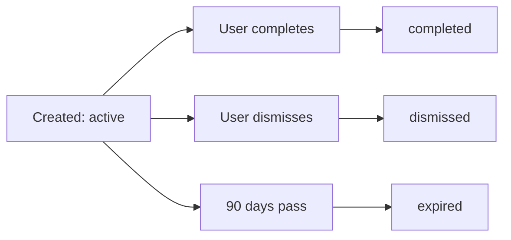

Action Items are Luna's intelligent coordination system. When enough users express interest in a venue, the booking agent automatically creates trackable action items to help groups coordinate plans.

## Threshold Triggers

Action items activate based on interest levels:

<Card title="5+ Users Threshold" icon="users-line">
When 5 or more users (across the entire platform, not just friends) express interest in the same venue, Luna's booking agent automatically creates an action item for all interested parties.
</Card>

### Why 5 Users?

The threshold balances exclusivity and achievability:

- **Not too easy** - Prevents spam from low-signal venues
- **Not too hard** - Achievable for moderately popular venues
- **Group-sized** - Perfect party size for most restaurant reservations
- **Configurable** - Can be adjusted per venue type in future updates

<Tip>
The threshold is platform-wide, meaning you might receive action items for venues where strangers (not just friends) are interested. This helps discover popular venues across the broader Luna community.
</Tip>

## Action Item Creation

When the threshold is met, the booking agent (`agent.py`) triggers:

### Generation Process

<Steps>
  <Step title="Interest Detection">
    When a user toggles interest, the backend counts total interested users for that venue.
  </Step>
  <Step title="Threshold Check">
    If count >= 5 AND no active action item exists, the agent activates.
  </Step>
  <Step title="Action Item Created">
    A new ActionItemDB record is created with:
    - Unique UUID identifier
    - Action code (e.g., "LUNA-venue_1-A3F2B7C9")
    - Description (e.g., "5 friends interested - coordinate plans!")
    - 90-day expiration
    - List of all interested user IDs
  </Step>
  <Step title="Response Returned">
    The API returns action item details in the interest response, triggering optional toast notifications.
  </Step>
</Steps>

### Action Codes

Each action item receives a unique reference code:

```
Format: LUNA-{venue_id}-{random_8_chars}
Example: LUNA-venue_1-A3F2B7C9
```

Use action codes for:
- Customer support inquiries
- Sharing with group members
- Booking coordination reference

## Action Types

Two types of action items are generated based on venue category:

### Book Venue

For venues requiring reservations:

- **Categories**: Restaurant, Bar, Club, Lounge, Bistro, Cafe
- **Purpose**: Coordinate booking with venue
- **Next Steps**: Contact venue with action code, confirm party size, select date/time

### Visit Venue

For venues without reservations:

- **Categories**: Museum, Park, Shop, Gallery, Outdoor, Entertainment
- **Purpose**: Coordinate meetup logistics
- **Next Steps**: Agree on date/time in group chat, plan transportation

<Note>
Action type detection is automatic based on venue category. The backend agent uses keyword matching against venue category strings.
</Note>

## Action Item Lifecycle

Action items progress through several states:

### Status Values

| Status | Description | User Action |
|--------|-------------|-------------|
| **active** | Newly created, awaiting action | Visible in Profile tab |
| **completed** | User marked as done | Moved to archive |
| **dismissed** | User chose to ignore | Removed from active list |
| **expired** | 90 days passed without action | Auto-archived |

### State Transitions



## Managing Action Items

Users interact with action items from the Profile tab:

### Action Item Card

Each card displays:

- **Venue Image** - Visual reference
- **Venue Name & Category** - Basic details
- **Description** - Generated message (e.g., "5 friends interested - coordinate plans!")
- **Action Code** - Unique reference for booking
- **Interested Count** - Number of users in the group
- **Complete Button** - Mark as done
- **Dismiss Button** - Remove from list

### Complete Action

When you complete an action item:

<Steps>
  <Step title="Tap Complete">
    User taps the checkmark button on the action item card
  </Step>
  <Step title="API Call">
    POST /action-items/{id}/complete with user_id
  </Step>
  <Step title="Status Update">
    Backend changes status from "active" to "completed"
  </Step>
  <Step title="Archive">
    Item moves to archived action items (accessible in Profile → History)
  </Step>
  <Step title="UI Update">
    Card disappears from active action items with animation
  </Step>
</Steps>

### Dismiss Action

When you dismiss an action item:

<Steps>
  <Step title="Tap Dismiss">
    User taps the X button on the action item card
  </Step>
  <Step title="API Call">
    DELETE /action-items/{id} endpoint
  </Step>
  <Step title="Removal">
    Backend marks item as "dismissed"
  </Step>
  <Step title="UI Update">
    Card removed from view immediately
  </Step>
</Steps>

<Warning>
Dismissing an action item is permanent. You won't see it again even if more users become interested. Use "Complete" if you want to keep a record.
</Warning>

## Expiration System

Action items automatically expire after 90 days:

### Auto-Expiration Process

1. Background job checks for action items where `created_at + 90 days < now`
2. Matching items transition to "expired" status
3. Expired items move to archive
4. Users receive notification (implementation pending)

### Preventing Expiration

To keep action items relevant:

- Complete them when you've coordinated plans
- Dismiss them if no longer interested
- Check your action items regularly (badge indicator in Profile tab)

## Notification Payload

When action items are created, the agent generates a push notification payload:

```json
{
  "title": "Booking Opportunity at {venue_name}",
  "body": "{count} of your friends are interested! Time to book.",
  "venue_id": "venue_1",
  "action_code": "LUNA-venue_1-A3F2B7C9",
  "interested_count": 5,
  "deep_link": "luna://venues/venue_1"
}
```

<Note>
Push notification delivery is pending APNs integration. Currently, notification payloads are logged server-side for debugging.
</Note>

## Privacy & Permissions

Action items respect user privacy:

### What's Shared

- Your user ID in the interested users list
- That you're interested in coordinating
- Your participation in the action item

### What's Private

- Your exact location
- Your phone number or email
- Communication happens through Luna's platform

## Future Enhancements

Planned improvements to the action item system:

<CardGroup cols={2}>
  <Card title="Group Chat" icon="comments">
    Automatic chat creation when action item triggers, enabling in-app coordination
  </Card>
  <Card title="Date Polling" icon="calendar-check">
    Find optimal meetup times using availability polls
  </Card>
  <Card title="Venue Integration" icon="handshake">
    Direct booking API connections for seamless reservations
  </Card>
  <Card title="Smart Reminders" icon="bell">
    Notifications when approaching expiration or when plans are made
  </Card>
</CardGroup>

## Best Practices

### For Users

1. **Check Regularly** - Review action items in your Profile tab weekly
2. **Complete Promptly** - Mark items as complete when you've booked to clear your list
3. **Communicate** - Use action codes when contacting venues for group reservations
4. **Be Decisive** - Dismiss items you're no longer interested in to reduce clutter

### For Venues

When receiving Luna action codes:

1. **Verify Code** - Confirm the code matches Luna's format
2. **Check Party Size** - Action items typically represent 5+ person groups
3. **Coordinate** - Work with the group to find suitable date/time
4. **Track** - Use action codes for internal reservation tracking